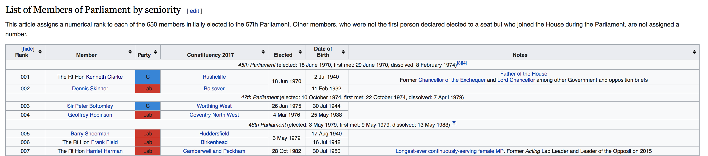
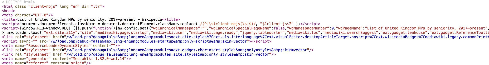
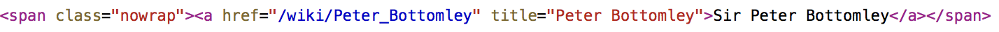
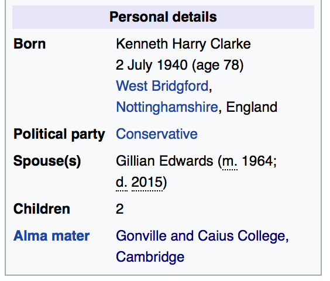
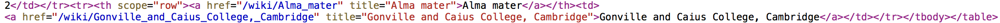

You will need to load the following libraries (you may need to use `install.packages()` first):
```{r, eval=T, message = F, warning=FALSE}
#install.packages("rtweet") -- You only need to install this once!
library(rtweet)
library(rvest)
library(xml2)
library(quanteda)
```

1. `rtweet` is an R wrapper for accessing [twitter's REST and stream APIs](https://github.com/mkearney/rtweet). 

2. `rvest` is a nice package which helps you to scrape information from web pages.

3. `xml2` is a package which includes functions that can make it (somewhat) easier to navigate through html data that is loaded into R.

4. If you don't know what `quanteda` is by now, what have you been doing for the past three days?

## Using an API

An Application Programming Interface (API) is often the most convenient way to collect well-structured data from the web. As in the lecture, we will cover an example here of getting data using the Twitter API using the [`twitteR`]() package and analysing it using `quanteda`. 

### Authentication

In theory,[^theory] you shouldn't need anything other than a Twitter account to be able to use the `rtweet` package. If you don't have a Twitter account: 1) Congratulations, you must be more productive than me, and 2) You will need to open one to interact with the API (sorry).

You should note that the use of the Twitter API is subject to [rate limits](https://developer.twitter.com/en/docs/twitter-api/rate-limits). This limits the amount of data you can retrieve at any time, and if you repeatedly call the functions below you will find that you start getting errors. If this happens, wait for 15 minutes and the rate limits will reset. Alternatively, you can register for more advanced access to the API, for example via the [Academic Research product track](https://developer.twitter.com/en/products/twitter-api/academic-research) which will give you the ability to collect far more Twitter data than could ever possibly be good for an individual.

[^theory]: In my experience, the interfaces for both the APIs themselves, and the R packages desgined to access those APIs, are not terribly stable. This is an indirect way of saying: if this code doesn't work for you, and you cannot access the API in class today, don't blame me! Instead, think of it as a lesson of all the potential dangers you might face by using tools like this in your research process. Kevin Munger has a nice [cautionary tale about this here](https://journals.sagepub.com/doi/full/10.1177/2056305119859294).

### Get some tweets

There are many functions in the `rtweet` package that allow you to grab tweets from the APIs. 

- `search_tweets()` -- Returns tweets matching a user provided search query from the past 6-9 days.

- `stream_tweets()` -- Returns tweets from the live stream

- `get_timelines()` -- Returns tweets from specific Twitter users

Let's start by collecting some recent Tweets about [Wimbledon](https://www.wimbledon.com):

```{r, eval = TRUE, echo = FALSE}

load("data/wimdledon_tweets.Rdata")

```

```{r, eval = FALSE, echo = TRUE}

wimdledon_tweets <- search_tweets("wimbledon", n = 200)

```

You will see that the returned object is a `tibble` object, which is just [a fancy version](https://cran.r-project.org/web/packages/tibble/vignettes/tibble.html) of a `data.frame`. 

1. What's in our tibble? Use the functions you have learned on this course to explore the data. Make sure that you can locate the text of the tweets you have collected.

### `quanteda` and `rtweet`

1. Convert the texts of your tweets into a quanteda `dfm` object. How many features are in your `dfm`?

2. What are the most common words in this corpus of tweets? 

3. Create a new `dfm` object that only includes the hashtags (#) in this corpus (use `dfm_select()` for this question). What are the most commonly used hastags? Hint: to find a hastag, use `patter = "#*"`, where the `*` is a wildcard which will match any string that follows directly on from a hashtag.

### Getting a bit meta

Beyond the text data, the Twitter API is very useful for collecting information about the structure of the network itself. Data on social network structures has played a prominent role in social science research in recent years, including being used to [estimate the positions of political actors in a common ideological space](http://pablobarbera.com/static/barbera_twitter_ideal_points.pdf); to describe the [effects of ideologically diverse news on opinion](https://science.sciencemag.org/content/348/6239/1130); and to study [how information spreads through a network](https://arxiv.org/abs/1202.3162), amongst many others.

Let's do a simple network task, and find the common set of people followed on twitter by the current number one ranked tennis players in the men and women's [tennis rankings](http://www.tennisnow.com/Rankings/WTA-Singles.aspx). I have done the first bit of data collection for you:

```{r, eval = FALSE}

player_accounts <- c("ashbarty", "DjokerNole")

```

```{r, eval = TRUE, echo = FALSE}

load("data/player_friends.Rdata")

```

The main functions you will need for this analysis are, 1) `get_friends()` which returns the list of users IDs for the accounts followed by one or more user, and 2) `lookup_users()` which will return meta data on a list of users. 

1. Use the `get_friends()` function to find the IDs of the accounts that are followed by the tennis players listed above.

2. You will notice that the output from `get_friends()` does not give any detail on the user accounts. Take the output from the question above, and use the `lookup_users()` function to return meta data on the people that are followed by the best tennis players in the world.

3. Finally, use your newly developed R skills to find the names of the twitter accounts that are followed by both players. 

## Scraping the web

*Warning: Collecting data from the web ("web scraping") is usually really annoying. There is no single function that will give you the information you need from a webpage. Instead, you must carefully and painfully write code that will give you what you want. If that sounds OK, then continue on with this problem set. If it doesn't, stop here, and do something else.*

Throughout this course, the modal structure of a problem set has been that we give you a nice, clean, rectangular `data.frame`, which you use for the application of some fancy method. Here, we are going to walk through an example of getting the horrible, messy, and oddly-shaped data from a webpage, and turning it into a `data.frame` that is usable.

Since no two websites are the same, web scraping usually requires you to identify in the html code that lies behind websites. The goal here is to parse the HTML into usable data. Generally speaking, there are three main steps for webscraping:
  
  1. access a web page from R
  2. tell R where to “look” on the page
  3. Manipulate the data in a usable format within R.
  4. (We don't speak about step 4 so much, but it normally includes smacking your head against your desk, wondering where things went wrong and generally questioning all your life choices. But we won't dwell on that here.)

We are going to set ourselves a typical data science-type task in which we are going to scrape some data about politicians from their wiki pages. In particular, our task is to establish which universities were most popular amongst the crop of UK MPs who served in the House of Commons between 2017 and 2019. It is often useful to define in advance what the exact goal of the data collection task is. For us, we would like to finish with a `data.frame` consisting of one observations for each MP, and two variables: the MPs name, and where they went to university.

### Step 1: Scrape a list of current MPs

First, we need to know which MPs are currently in parliament. A bit of googling shows that [this wiki page](https://en.wikipedia.org/wiki/List_of_United_Kingdom_MPs_by_seniority_(2017–2019)) gives us what we need. Scroll down a little, and you will see that there is a table where each row is an MP. It looks like this: 



The nice thing about this is that an html table like this should be reasonably easy to work with. We will need to be able to work with the underlying html code of the wiki page in what follows, so you will need to be able to see the source code of the website. If you don't know how to look at the source code, follow the relevant instructions on [this page](https://www.computerhope.com/issues/ch000746.htm) for the browser that you are using.

When you have figured that out, you should be able to see something that looks a bit like this:


As you can see, html is horrible to look at. In R, we can read in the html code by using the `read_html` function from the `rvest` package:

```{r}

# Read in the raw html code of the wiki page
mps_list_page <- read_html("https://en.wikipedia.org/wiki/List_of_United_Kingdom_MPs_by_seniority_(2017–2019)")

```

`read_html` returns an XML document (to check, try running `class(mps_list_page)`), which makes navigating the different parts of the website (somewhat) easier. 

Now that we have the html code in R, we need to find the parts of the webpage that contain the table. Scroll through the source code that you should have open in your browser to see if you can find the parts of the code that contain the table we are interested in.

On line 285, you should see something like `<table class="wikitable collapsible sortable" style="text-align: center; font-size: 85%; line-height: 14px;">`. This marks the beginning of the table that we are interested in, and we can ask `rvest` to extract that table from our `mps_list_page` object by using the `xml_find_all` function.

```{r}

# Extract table of MPs
mp_table <- xml_find_all(mps_list_page, xpath = "//table[@class='wikitable collapsible sortable']")

```

Here, the string we pass to the `xpath` argument tells `rvest` that we would like to grab the `table` from the object `mps_list_page` that has the class `wikitable collapsible sortable`. The object we have created (`mp_table`) is itself an XML object, which is good, because we will need to navigate through that table to get the information we need.

Now, within that table, we would like to extract two pieces of information for each MP: their name, and the link to their own individual wikipedia page. Looking back at the html source code, you should be able to see that each MP's entry in the table is contained within its own separate `<span>` tag, and the information we are after is further nested within a `<a>` tag. For example, line 276 includes the following:



Yes, Bottomley is a funny name.

We would like to extract all of these entries from the table, and we can do so by again using `xml_find_all` and using the appropriate Xpath expression, which here is `".//span/a"`, where the full-stop indicates that we would like to search only within this table.

```{r}

mp_table_entries <- xml_find_all(mp_table, xpath = ".//span/a")

```

Finally, now that we have the entry for each MP, it is very simple to extract the name of the MP and the URL to their wikipedia page:
```{r}

mp_names <- xml_text(mp_table_entries) # xml_text returns the text between the tags (here, the MPs' names)

mp_hrefs <- xml_attr(mp_table_entries, "href") # xml_attr returns the attrubutes of the tags that you have named. Here we have asked for the "href" which will give us the link to each MP's own wiki page 

# Combine into a data.frame
mps <- data.frame(name = mp_names, url = mp_hrefs, university = NA, stringsAsFactors = FALSE)
head(mps)
```

OK, OK, so those urls are not quite complete. We need to fix "https://en.wikipedia.org" to the front of them first. We can do that using `paste()`:

```{r}

mps$url <- paste("https://en.wikipedia.org", mps$url, sep = "")
head(mps)
```

That's better. Though, wait, how many observations are there in our `data.frame`?

```{r}
dim(mps)
```

652? But there are only 650 MPs in the House of Commons! Oh, I know why, it's because some MPs will have left/died/[been caught in a scandal](https://www.theguardian.com/politics/2019/mar/22/tory-mp-christopher-davies-admits-expenses-offences) and therefore have been replaced...

Are you still here? Well done! We have something! We have...a list of MPs' names! But we don't have anything else. In particular, we still do not know where these people went to university. To find that, we have to move on to step 2.

### Step 2: Scrape the wiki page for each MP

Let's look at the page for the first MP in our list: [https://en.wikipedia.org/wiki/Kenneth_Clarke](https://en.wikipedia.org/wiki/Kenneth_Clarke). Scroll down the page, looking at the panel on the right-hand side. At the bottom of the panel, you will see this:



The bottom line gives Clarke's alma mater, which in this case is one of the Cambridge colleges. That is the information we are after. If we look at the html source code for this page, we can see that the alma mater line of the panel is enclosed in another `<a>` tag:



Now that we know this, we can call in the html using `read_html` again:

```{r}

mp_text <- read_html(mps$url[1])

```

And then we can use `xml_find_all` and `xml_text` to extract the name of the university. The `xpath` argument is a bit more complicated here. We are telling `rvest` to look for the tag `a` with a title of `"Alma mater"`, and then asking `rvest` to look for the *next* `a` tag that comes after the alma mater tag. This is because the name of the university is actually stored in the subsequent `a` tag.

```{r}
  
mp_university <- xml_text(xml_find_all(mp_text, xpath = "//a[@title='Alma mater']/following::a[1]"))
print(mp_university)

```

Regardless of whether you followed that last bit: it works! We now know where Kenneth Clarke went to university. Finally, we can assign the university that he went to to the `mps` `data.frame` that we created earlier:

```{r}
  
mps$university[1] <- mp_university
head(mps)
  
```


### Scraping exercises

1. Figure out how to collect this university information for all of the other MPs in the data. You will need to write a for-loop, which iterates over the URLs in the `data.frame` we just constructed and pulls out the relevant information from each MP's wiki page. You will find very quickly that web-scraping is a messy business, and your loop will probably fail. You might want to use the `stop`, `next`, `try` and `if` functions to help avoid problems.

2. Which was the modal university for the current set of UK MPs?

3. Go back to the scraping code and see if you can add some more variables to the data.frame. Can you scrape the MPs' party affiliations? Can you scrape their date of birth? Doing so will require you to look carefully at the html source code, and work out the appropriate xpath expression to use. For guidance on xpath, see [here](https://blog.scrapinghub.com/2016/10/27/an-introduction-to-xpath-with-examples).
