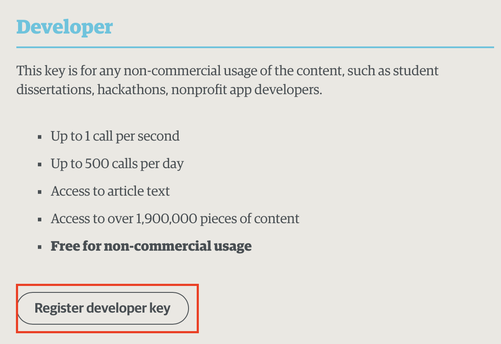
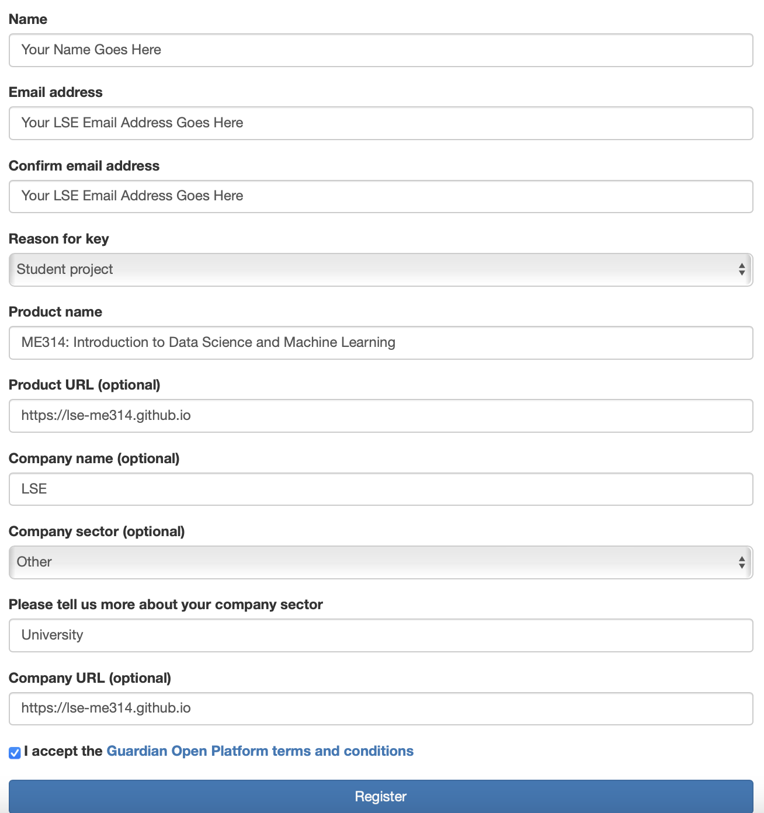

# APIs

## Packages

You will need to load the following packages before beginning the assignment

```{r, echo = TRUE, eval=TRUE, message=FALSE, warning=FALSE}
library(tidyverse)
library(quanteda)
library(guardianapi)
# Run the following code if you cannot load the guardianapi package:
# devtools::install_github("evanodell/guardianapi")
# Or, alternatively:
# install.packages("guardianapi")
```

## Using an API to Collect Text Data

An Application Programming Interface (API) is often the most convenient way to collect well-structured data from the web. We will cover an example here of getting data using the Guardian Newspaper API using the [`guardianapi`]() package and analysing it using `quanteda`.

### Authentication

In theory,[^seminar5-1] the Guardian API only requires very minimal effort to access. In particular, to access the API you need to register for a developer API key, which you can do by visiting [this webpage](https://open-platform.theguardian.com/access/). You will need to select the "Register developer key" option on that page:

[^seminar5-1]: In my experience, the interfaces for both the APIs themselves, and the R packages desgined to access those APIs, are not terribly stable. This is an indirect way of saying: if this code doesn't work for you, and you cannot access the API in class today, don't blame me! Instead, think of it as a lesson of all the potential dangers you might face by using tools like this in your research process. Kevin Munger has a nice cautionary tale about this [here](https://journals.sagepub.com/doi/full/10.1177/2056305119859294).



Once you have clicked that button, you will be taken to a page where you can add details of your project.

Fill in the details on that form as follows:



You should receive an email asking you to confirm your LSE email address, and then a second email which contains your API key. It will be a long string like `"g257t1jk-df09-4a0c-8ae5-101010d94e428"`. **Make sure you save this key somewhere!**

You can then authenticate with the API by using the `gu_api_key()` function:

```{r, echo=TRUE, eval=FALSE}

gu_api_key()

```

When you run that function, you will see the following message appear in your R console.

```{r, echo=FALSE, eval=TRUE}

message("Please enter your API key and press enter:")

```

Paste the API key that you received via email into the console and you should see the following message:

```{r, echo=FALSE, eval=TRUE}

message("Updating gu.API.key session variable...")

```

You should now be able to use the API functions that are available in the `guardianapi` package! We will cover some of these functions below.

### Retrieve some newspaper articles

We will start by using the `gu_content()` function to retrieve some data from the API. This function takes a number of arguments, some of the more important ones are listed in the table below:

| Argument            | Description                                                                                                                                                                                                                             |
|:-----------------------------------|:-----------------------------------|
| `query`             | A string containing the search query. Today, you can choose a simple query which will retrieve any newspaper article published in the Guardian that contains that term.                                                                 |
| `from_date`         | The start date that we would like to constrain our search. This argument should be a character of the form `"YYYY-MM-DD"`. We will use `"2021-01-01"` today so that we will gather articles published on the 1st January 2021 or later. |
| `to_date`           | The end date of our search. We will use `"2021-12-31"`, so as to collect articles up to 31st December 2021.                                                                                                                             |
| `production_office` | The Guardian operates in several countries and this argument allows us to specify which version of the Guardian we would like to collect data from. We will set this to `"UK"` so that we collect news stories published in the UK.     |

: Arguments to the `gu_content()` function.


1.  Execute the `gu_content()` function using the arguments as specified in the table above. There are two very important things to remember about this step:

    a.  Don't forget to save the output of this function to an object!
    b.  Don't run this function more times than you need to (hopefully just once). Each time you run the function you are making repeated calls to the Guardian API and if you use it too many times you will exceed your rate limit for the day and will have to wait until tomorrow for it to reset.

<details>

<summary>Reveal code</summary>

```{r, echo=TRUE, eval=FALSE}

# You should only run this function once so as to not repeatedly make calls to the API
gu_out <- gu_content(query = "YOUR_SEARCH_TERM_GOES_HERE", 
                     from_date = "2021-01-01", 
                     to_date = "2021-12-31",
                     production_office = "UK")

```

> I used the term `"china"` for the `query` argument, but you can select whatever search term you like.

</details>

2.  Save the object you have created.

<details>

<summary>Reveal code</summary>

```{r, echo=TRUE, eval=FALSE}

save(gu_out, file = "gu_out.Rdata")

```

You can then load the data file (if you need to) using the `load()` function as usual:

```{r, echo=TRUE, eval=TRUE}

load(file = "gu_out.Rdata")

```

</details>

3.  Inspect the output.

<details>

<summary>Reveal code</summary>

```{r, echo=TRUE, eval=TRUE}
glimpse(gu_out)
```

> We have successfully retrieved `r nrow(gu_out)` articles that contain the term `"china"` in 2021.

> We get a lot of information about these articles! In addition to the text of the article (`body_text`), we also get the title of each article (`web_title`), the date of publication (`first_publication_date`), the section of the newspaper in which the article appeared (`section_name`), the author of the article (`byline`), as well as many other pieces of potentially useful metadata.

</details>

### Analyse the Guardian Texts

1.  Convert the texts of these articles (use the `body_text` variable) into a quanteda `dfm` object. How many features are in your `dfm`?

<details>

<summary>Reveal code</summary>


```{r, echo = TRUE, eval = TRUE}

# Convert to corpus
gu_corpus <- corpus(gu_out, text_field = "body_text")

# Tokenize
gu_tokens <- gu_corpus %>% 
  tokens(remove_punct = T,
         remove_symbols = T,
         remove_url = T)

# Convert to DFM
gu_dfm <- gu_tokens %>% 
  dfm() %>%
  dfm_remove(stopwords("en")) %>%
  dfm_trim(max_docfreq = .9,
           docfreq_type = "prop",
           min_termfreq = 10)

gu_dfm

```

</details>

2.  What are the most common words in this corpus of tweets?

<details>

<summary>Reveal code</summary>

```{r, echo = TRUE, eval = TRUE}

topfeatures(gu_dfm)

```

</details>

3.  Using the methods we covered in the course, find out something interesting about the data you have collected. Produce at least one plot and write a paragraph of text explaining what you have discovered.

<details>

<summary>Reveal code</summary>

```{r, echo = TRUE, eval = TRUE}

library(quanteda.dictionaries)

covid_dictionary <- c("covid*", "covid19", "covid-19", "coronavirus*", "lockdown*", "vaccination*")

covid_dictionary <- dictionary(list(covid = covid_dictionary))

gu_covid_dfm <- dfm_lookup(gu_dfm, covid_dictionary)

gu_covid_dfm_proportions <- gu_covid_dfm/ntoken(gu_dfm)

gu_out$covid <- as.numeric(gu_covid_dfm_proportions[,1])

gu_out %>%
  ggplot(aes(x = web_publication_date,
             y = covid)) + 
  geom_point() + 
  theme_bw() +
  ylab("Proportion of COVID-19 words") + 
  xlab("Publication Date")

```

</details>

# Web-Scraping

*Warning: Collecting data from the web ("web scraping") is usually really annoying. There is no single function that will give you the information you need from a webpage. Instead, you must carefully and painfully write code that will give you what you want. If that sounds OK, then continue on with this problem set. If it doesn't, stop here, and do something else.*

### Packages

You will need to load the following libraries to complete this part of the assignment (you may need to use `install.packages()` first):

```{r, eval=TRUE, message = FALSE, warning=FALSE}
library(rvest)
library(xml2)
```

1.  `rvest` is a nice package which helps you to scrape information from web pages.

2.  `xml2` is a package which includes functions that can make it (somewhat) easier to navigate through html data that is loaded into R.

### Overview

Throughout this course, the modal structure of a problem set has been that we give you a nice, clean, rectangular `data.frame` or `tibble`, which you use for the application of some fancy method. Here, we are going to walk through an example of getting the horrible, messy, and oddly-shaped data from a webpage, and turning it into a `data.frame` or `tibble` that is usable.

Since no two websites are the same, web scraping requires you to identify the relevant parts of the html code that lies behind websites. The goal here is to parse the HTML into usable data. Generally speaking, there are three main steps for webscraping:

1.  Access a web page from R
2.  Tell R where to "look" on the page
3.  Manipulate the data in a usable format within R.
4.  (We don't speak about step 4 so much, but it normally includes smacking your head against your desk, wondering where things went wrong and generally questioning all your life choices. But we won't dwell on that here.)

We are going to set ourselves a typical data science-type task in which we are going to scrape some data about politicians from their wiki pages. In particular, our task is to establish which universities were most popular amongst the crop of UK MPs who served in the House of Commons between 2017 and 2019. It is often useful to define in advance what the exact goal of the data collection task is. For us, we would like to finish with a `data.frame` or `tibble` that consists of one observation for each MP, and two variables: the MP's name, and where they went to university.

### Step 1: Scrape a list of current MPs

First, we need to know which MPs were in parliament in this period. A bit of googling shows that [this wiki page](https://en.wikipedia.org/wiki/List_of_United_Kingdom_MPs_by_seniority_(2017–2019)) gives us what we need. Scroll down a little, and you will see that there is a table where each row is an MP. It looks like this:


The nice thing about this is that an html table like this should be reasonably easy to work with. We will need to be able to work with the underlying html code of the wiki page in what follows, so you will need to be able to see the source code of the website. If you don't know how to look at the source code, follow the relevant instructions on [this page](https://www.computerhope.com/issues/ch000746.htm) for the browser that you are using.

When you have figured that out, you should be able to see something that looks a bit like this: 


As you can see, html is horrible to look at. In R, we can read in the html code by using the `read_html` function from the `rvest` package:

```{r}

# Read in the raw html code of the wiki page
mps_list_page <- read_html("https://en.wikipedia.org/wiki/List_of_United_Kingdom_MPs_by_seniority_(2017–2019)")

```

`read_html` returns an XML document (to check, try running `class(mps_list_page)`), which makes navigating the different parts of the website (somewhat) easier.

Now that we have the html code in R, we need to find the parts of the webpage that contain the table. Scroll through the source code that you should have open in your browser to see if you can find the parts of the code that contain the table we are interested in.

On line 1154, you should see something like `<table class="wikitable collapsible sortable" style="text-align: center; font-size: 85%; line-height: 14px;">`. This marks the beginning of the table that we are interested in, and we can ask `rvest` to extract that table from our `mps_list_page` object by using the `html_elements` function.

```{r, echo = TRUE, eval = TRUE}

# Extract table of MPs
mp_table <- html_elements(mps_list_page, 
                          css = "table[class='wikitable collapsible sortable']")

```

Here, the string we pass to the `css` argument tells `rvest` that we would like to grab the `table` from the object `mps_list_page` that has the class `wikitable collapsible sortable`. The object we have created (`mp_table`) is itself an XML object, which is good, because we will need to navigate through that table to get the information we need.

Now, within that table, we would like to extract two pieces of information for each MP: their name, and the link to their own individual wikipedia page. Looking back at the html source code, you should be able to see that each MP's entry in the table is contained within its own separate `<span>` tag, and the information we are after is further nested within a `<a>` tag. For example, line 1250 includes the following:


Yes, Bottomley is a funny name.

We would like to extract all of these entries from the table, and we can do so by again using `html_elements` and using the appropriate css expression, which here is `"span a"`, because the information we want is included in the `a` tag which itself is nested within the `span` tag.

```{r, echo = TRUE, eval = TRUE}

# Extract MP names and urls
mp_table_entries <- html_elements(mp_table, "span a")
mp_table_entries
```

Finally, now that we have the entry for each MP, it is very simple to extract the name of the MP and the URL to their wikipedia page:

```{r, echo = TRUE, eval = TRUE}

# html_text returns the text between the tags (here, the MPs' names)
mp_names <- html_text(mp_table_entries) 

# html_attr returns the attrubutes of the tags that you have named. Here we have asked for the "href" which will give us the link to each MP's own wiki page 
mp_hrefs <- html_attr(mp_table_entries, 
                      name = "href") 

# Combine into a tibble
mps <- tibble(name = mp_names, url = mp_hrefs, university = NA, stringsAsFactors = FALSE)
head(mps)
```

OK, OK, so those urls are not *quite* complete. We need to fix "https://en.wikipedia.org" to the front of them first. We can do that using the `paste0()` function:

```{r, echo = TRUE, eval = TRUE}

mps$url <- paste0("https://en.wikipedia.org", mps$url)
head(mps)

```

That's better. Though, wait, how many observations are there in our `data.frame`?

```{r, echo = TRUE, eval = TRUE}

dim(mps)

```

`r nrow(mps)`? But there are only 650 MPs in the House of Commons! Oh, I know why, it's because some MPs will have left/died/[been caught in a scandal](https://www.theguardian.com/politics/2019/mar/22/tory-mp-christopher-davies-admits-expenses-offences) and therefore have been replaced...

Are you still here? Well done! We have something! We have...a list of MPs' names! But we don't have anything else. In particular, we still do not know where these people went to university. To find that, we have to move on to step 2.

### Step 2: Scrape the wiki page for each MP

Let's look at the page for the first MP in our list: <https://en.wikipedia.org/wiki/Kenneth_Clarke>. Scroll down the page, looking at the panel on the right-hand side. At the bottom of the panel, you will see this:


The bottom line gives Clarke's alma mater, which in this case is one of the Cambridge colleges. That is the information we are after. If we look at the html source code for this page, we can see that the alma mater line of the panel is enclosed in another `<a>` tag:


Now that we know this, we can call in the html using `read_html` again:

```{r, echo = TRUE, eval = TRUE}

mp_text <- read_html(mps$url[1])

```

And then we can use `html_elements` and `html_text` to extract the name of the university. Here we use a somewhat more complicated argument to find the information we are looking for. The `xpath` argument tells `rvest` to look for the tag `a` with a title of `"Alma mater"`, and then asking `rvest` to look for the *next* `a` tag that comes after the alma mater tag. This is because the name of the university is actually stored in the subsequent `a` tag.

```{r, echo = TRUE, eval = TRUE}
  
mp_university <- html_elements(mp_text, 
                               xpath = "//a[@title='Alma mater']/following::a[1]") %>%
                 html_text()
print(mp_university)

```

Regardless of whether you followed that last bit: it works! We now know where Kenneth Clarke went to university. Finally, we can assign the university that he went to to the `mps` `tibble` that we created earlier:

```{r, echo = TRUE, eval = TRUE}
  
mps$university[1] <- mp_university
head(mps)
  
```

### Scraping exercises

1.  Figure out how to collect this university information for all of the other MPs in the data. You will need to write a for-loop, which iterates over the URLs in the `data.frame` we just constructed and pulls out the relevant information from each MP's wiki page. You will find very quickly that web-scraping is a messy business, and your loop will probably fail. You might want to use the `stop`, `next`, `try` and `if` functions to help avoid problems.

<details>

<summary>Show solution</summary>

A for-loop is pretty easy to set up given the code provided above. We just need to loop over each row of the `mps` object, read in the html, find the university, and assign it to the relevant cell in the data.frame. E.g.

```{r, eval=FALSE, echo=TRUE}

for(i in 1:nrow(mps)){
  cat('.')
  
  mp_text <- read_html(mps$url[i])

  mp_university <- html_elements(mp_text, 
                               xpath = "//a[@title='Alma mater']/following::a[1]") %>%
                   html_text()

  mps$university[i] <- mp_university


}

```

Here, `cat('.')` is just a piece of convenience code that will print out a dot to the console on every iteration of the loop. This just helps us to know that R hasn't crashed or that nothing is happening. It's also quite satisfying to know that every time a dot appears, that means that you have collected some new data.

However, if you try running that code, you'll see that it will cut out after a short while with an error.

The main difficulty with this exercise is that there are essentially an infinite number of ways in which data scraping can go wrong. Here, the main problems is that some of the MPs do not actually have any information recorded in their wiki profiles about the university that they attended. Look at the page for [Ronnie Campbell](https://en.wikipedia.org/wiki/Ronnie_Campbell) for example. Never went to university, but certainly looks like a happy chap.

Because of that, we need to build in some code into the loop that says 'OK, if you can't find any information about this MP's university, just code it as `NA`.' I've added a line that does this to the loop.

```{r, eval = FALSE, echo=TRUE}

for(i in 1:nrow(mps)){
  cat(".")

  mp_text <- read_html(mps$url[i])
  
  mp_university <- xml_text(xml_find_all(mp_text, xpath = "//a[@title='Alma mater']/following::a[1]"))
  
  if(length(mp_university)==0) mp_university <- NA
  
  mps$university[i] <- mp_university

}

```

```{r, echo=FALSE}

load("mps_alma_mater.Rdata")

```

Now the loop runs without breaking! Hooray!

(It is worth noting that this is a very simple example. In the typical web-scraping exercise, you should expect considerably more frustration than you have encountered here. :) Enjoy!)

</details>


2.  Which was the modal university for the current set of UK MPs?

<details>

<summary>Show solution</summary>

```{r, eval=TRUE, echo = TRUE}

sort(table(mps$university), decreasing = T)[1]

```

So, LSE is the most popular university for MPs? That seems...unlikely... And indeed it is. Remember the Kenneth Clarke example: wiki lists the college he attended in Cambridge, not just the university. Maybe lots of MPs went to Cambridge, but they all just went to different colleges? Let's check:

```{r, eval=TRUE, echo = TRUE}
unique(mps$university[grep("Cambridge",mps$university)])
```

Oh dear. Maybe it is the same for Oxford?

```{r, eval=TRUE, echo = TRUE}
unique(mps$university[grep("Oxford",mps$university)])
```

Yup.

Right, so we need to do some recoding. Let's create a new variable that we can use to simplify the universities coding:

```{r, eval=TRUE, echo = TRUE}

mps$university_new <- mps$university

mps$university_new[grep("Cambridge",mps$university)] <- "Cambridge"
mps$university_new[grep("Oxford",mps$university)] <- "Oxford"
mps$university_new[grep("London School of Economics",mps$university)] <- "LSE"

head(sort(table(mps$university_new), decreasing = T))

```

Looks like the Oxbridge connection is still pretty strong!

</details>


3.  Go back to the scraping code and see if you can add some more variables to the `tibble`. Can you scrape the MPs' party affiliations? Can you scrape their date of birth? Doing so will require you to look carefully at the html source code, and work out the appropriate xpath expression to use. For guidance on xpath, see [here](https://blog.scrapinghub.com/2016/10/27/an-introduction-to-xpath-with-examples).

<details>

<summary>Show solution</summary>

```{r, eval=FALSE, echo = TRUE}

mps$university <- NA
mps$party <- NA
mps$birthday <- NA

for(i in 1:nrow(mps)){
  cat(".")

  mp_text <- read_html(mps$url[i])
  
  mp_university <- html_elements(mp_text, xpath = "//a[@title='Alma mater']/following::a[1]") %>% 
                   html_text()
  mp_party <- html_elements(mp_text, xpath = "////tr/th[text()='Political party']/following::a[1]") %>% 
              html_text()
  mp_birthday <- html_elements(mp_text, xpath = "//span[@class='bday']") %>% 
                 html_text()
  
  if(length(mp_university)==0) mp_university <- NA
  if(length(mp_party)==0) mp_party <- NA
  if(length(mp_birthday)==0) mp_birthday <- NA
  
  mps$university[i] <- mp_university
  mps$party[i] <- mp_party
  mps$birthday[i] <- mp_birthday


}

save(mps, file = "mps_alma_mater.Rdata")

```

```{r, eval=TRUE, echo = FALSE}

load(file = "mps_alma_mater.Rdata")

```

```{r, eval=TRUE, echo = TRUE}
head(mps)
```

</details>
